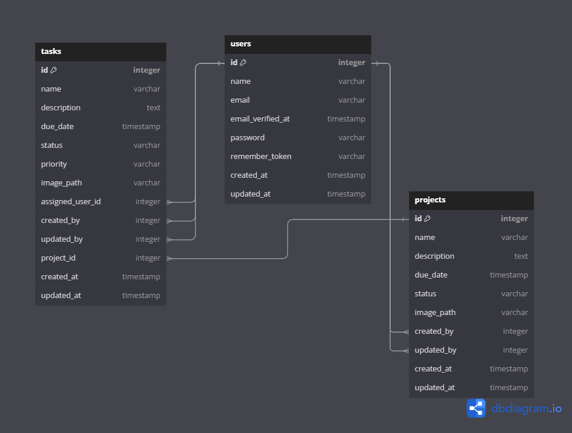
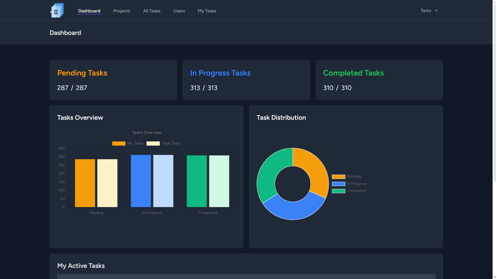
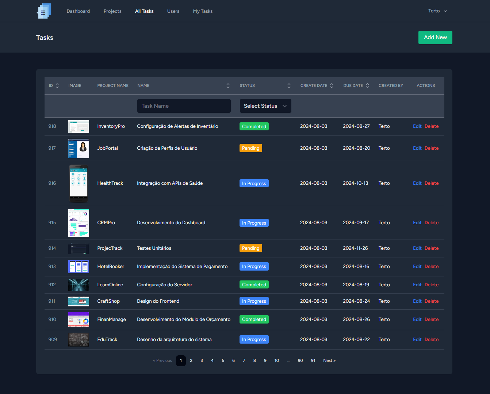
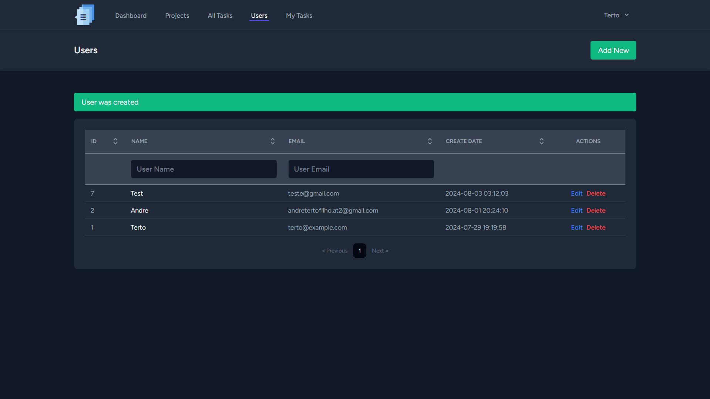
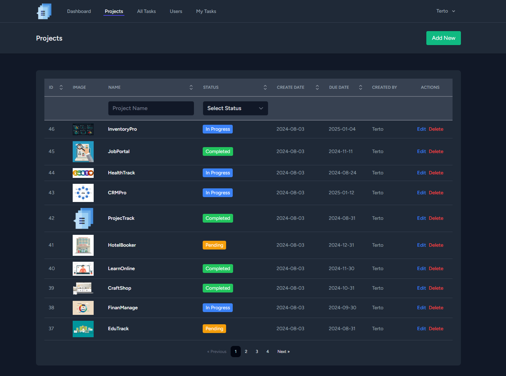
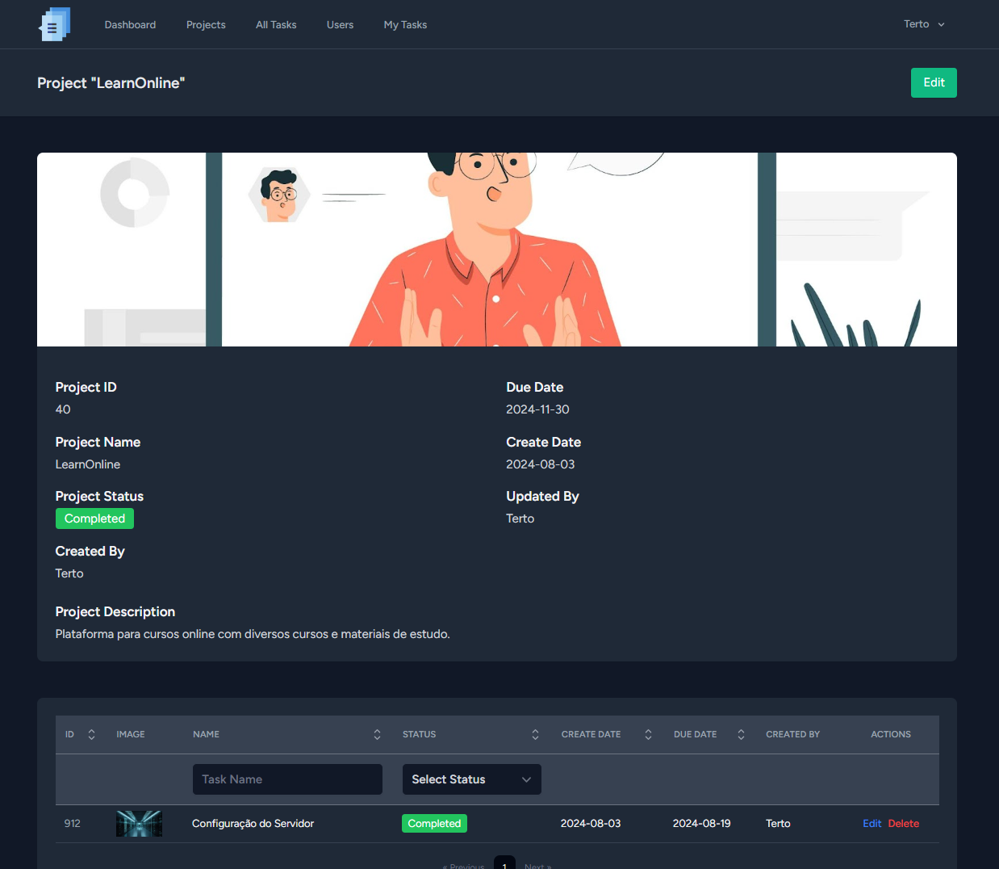
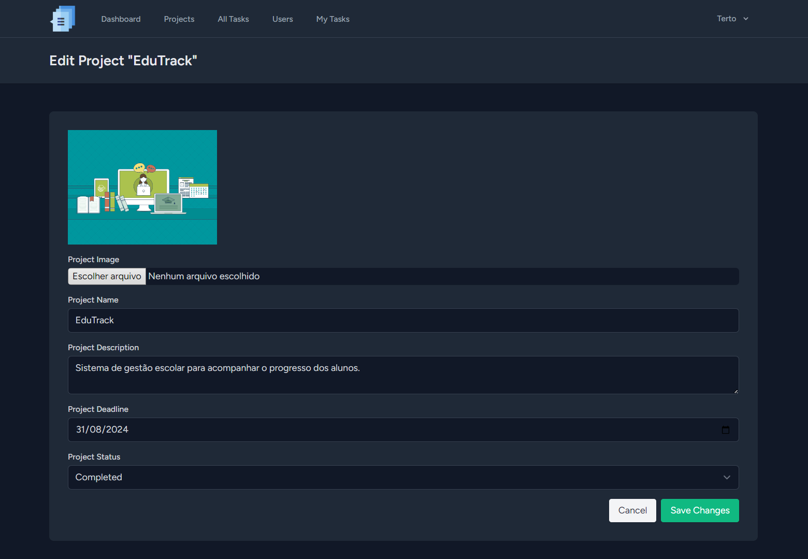

# ProjecTrack

## Descrição

O ProjecTrack é um sistema de gerenciamento de projetos que permite a criação, visualização e gerenciamento de projetos e tarefas. Com funcionalidades para múltiplos usuários, oferece uma interface intuitiva para gerenciar tarefas, atribuí-las a usuários, e visualizar o progresso dos projetos.

## Funcionalidades

- **Registro e Login**: Crie uma conta e faça login para acessar suas informações.
- **CRUD de Projetos**: Crie, leia, atualize e exclua projetos. Inclui funcionalidades de ordenação, filtragem e paginação.
- **CRUD de Tarefas**: Crie, leia, atualize e exclua tarefas. Inclui funcionalidades de ordenação, filtragem e paginação.
- **Atribuição de Tarefas**: Atribua tarefas a usuários e visualize as tarefas atribuídas a você.
- **Visão Geral do Dashboard**: Veja uma visão geral do progresso das suas tarefas e projetos, incluindo gráficos de progresso, distribuição de tarefas por status e uma lista das tarefas ativas.
- **Integração com Calendário**: Sincronize tarefas e prazos com calendários externos.

## Tecnologias

### Frontend 

- **HTML / CSS / JS / TypeScript**
  - Tecnologias para desenvolvimento e estilização de páginas web.
- **React** 
  - Biblioteca JavaScript para construir interfaces de usuário.
- **Tailwind CSS** 
  - Framework de utilitários CSS para estilização rápida e responsiva.
- **Vite** 
  - Ferramenta de construção e desenvolvimento para aplicações JavaScript modernas.
- **Inertia.js** 
  - Facilita a comunicação entre o backend Laravel e o frontend React.
- **Breeze** 
  - Ferramenta para autenticação e scaffolding, que inclui componentes de frontend básicos.
- **Chart.js** 
  - Biblioteca para criação de gráficos e visualizações de dados.

### Backend 

- **PHP** 
  - Linguagem de programação usada pelo Laravel.
- **Laravel** 
  - Framework PHP para desenvolvimento web.
- **Inertia.js** 
  - Integra Laravel com frameworks de frontend para uma SPA sem API separada.
- **Breeze** 
  - Usado para autenticação e configuração básica do backend.
- **Composer** 
  - Gerenciador de pacotes PHP para instalar dependências do Laravel.

### Banco de Dados 

- **PostgreSQL**
  - Sistema de gerenciamento de banco de dados relacional.

## Arquitetura do Projeto

### Desenho do Banco de Dados

O desenho do banco de dados fornece detalhes sobre as tabelas, colunas e relacionamentos no banco de dados. Veja o diagrama abaixo para uma visão detalhada do esquema do banco de dados:

## Print das Páginas

### Dashboard Page

### Tasks Page

### Users Page

### Project Page

### Project Show Page

### Project Edit Page

## Instalação e Execução

1. **Clone o projeto**
    
    `git clone <URL-DO-REPOSITORIO>`
    
2. **Navegue até o diretório raiz do projeto**
    
    Use o terminal para acessar o diretório onde o projeto foi clonado.
    
3. **Crie o arquivo `.env`**
    
    Execute o comando: `cp .env.example .env`
    
4. **Instale as dependências do backend**
    
    Execute o comando: `composer install`
    
5. **Instale as dependências do frontend**
    
    Execute o comando: `npm install`
    
6. **Configure a chave da aplicação**
    
    Execute o comando: `php artisan key:generate --ansi`
    
7. **Execute as migrações e insira dados iniciais**
    
    Execute o comando: `php artisan migrate --seed`
    
8. **Inicie o servidor de desenvolvimento do Vite**
    
    Execute o comando: `npm run dev`
    
9. **Inicie o servidor Artisan**
    
    Execute o comando: `php artisan serve`
    

## Exemplos de Uso

- **Visualizar Projetos**: Navegue para `/projects` para ver uma lista de projetos.
- **Criar Tarefas**: No projeto selecionado, vá para `/projects/{id}/tasks` para adicionar novas tarefas.
- **Atribuir Tarefas**: Ao criar ou editar uma tarefa, selecione o usuário para atribuí-la.
- **Visualizar Dashboard**: Acesse `/dashboard` para ver a visão geral das suas tarefas e projetos.

## Estrutura do Projeto

A estrutura de pastas segue o padrão do Laravel com algumas adições para o frontend React. As principais pastas são:

- `app/`: Contém o código-fonte do Laravel.
- `resources/`: Contém arquivos de front-end como views e componentes React.
- `routes/`: Define as rotas da aplicação.
- `database/`: Contém as migrações e seeders.

## Testes

Embora não haja testes automatizados implementados, o projeto utiliza factories e seeders para criar dados de exemplo para teste.

## Licença

Este projeto está licenciado sob a licença MIT.

## Contato

- **E-mail**: [andreterto.dev@gmail.com](mailto:andreterto.dev@gmail.com)
- **LinkedIn**: [Andre Terto](https://www.linkedin.com/in/andretertodev/)
- **GitHub**: [AndreTerto-dev](https://github.com/AndreTerto-dev)
